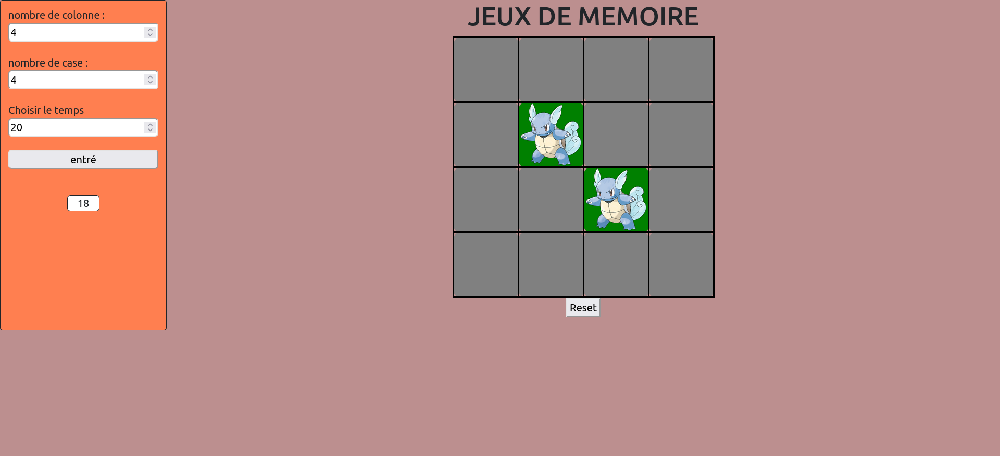

# Memory Game Project

This project was created as part of my educational program to introduce me to algorithmic thinking. It's a memory game featuring Pokémon, designed and implemented using HTML, CSS, and JavaScript. The game includes logic for matching pairs of Pokémon, animations, and sound effects upon winning.

## How to Play

1. Open the `index.html` file in your web browser.

2. Configure the game:
   - **Column Count**: The number of columns is adjustable and must be an even number.
   - **Game Time**: The game time is adjustable, and for each correct pair matched, you gain 5 seconds.

3. Start the game by clicking on cards to reveal Pokémon images. Match pairs to clear the board.

4. The game ends when all pairs are matched. Try to finish with the best time possible!

## Features

- A user-friendly interface with Pokémon-themed cards for an engaging experience.
- Customize the number of columns and game time to your liking.
- Animation and sound effects add excitement and fun to the game.
- Test your memory skills by matching all the pairs in the shortest time.

Enjoy playing the Memory Game with Pokémon!
